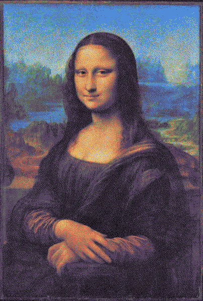
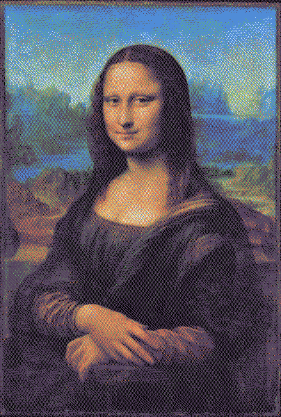
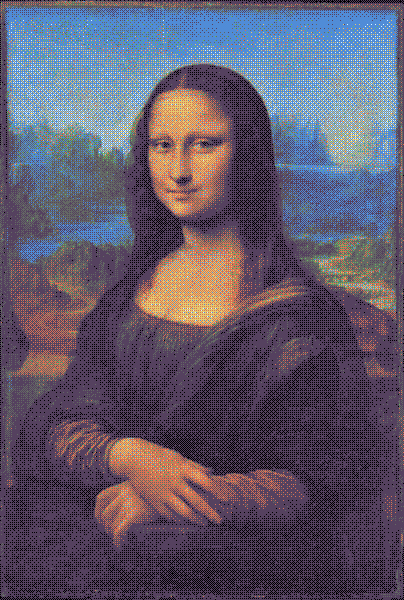
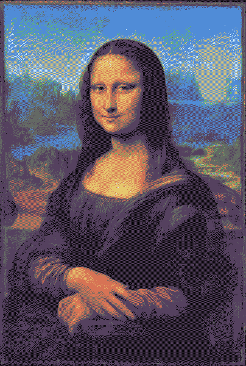
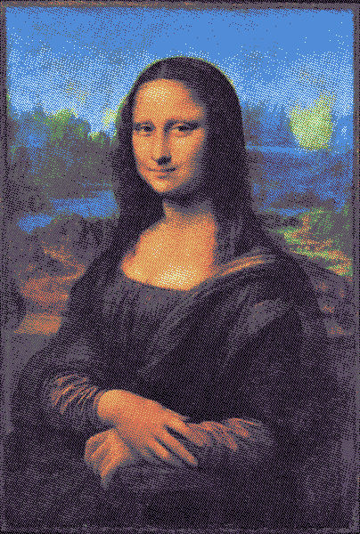
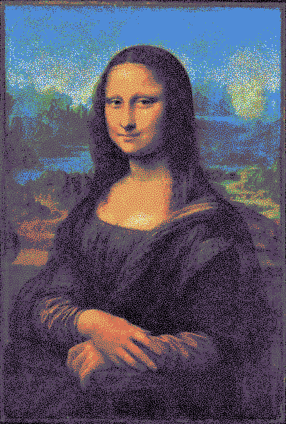
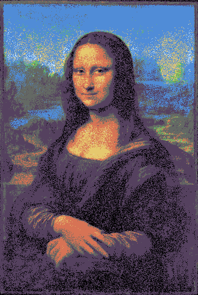
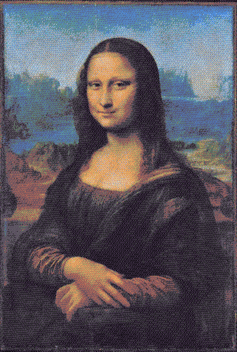
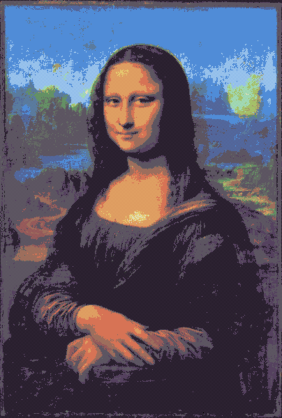
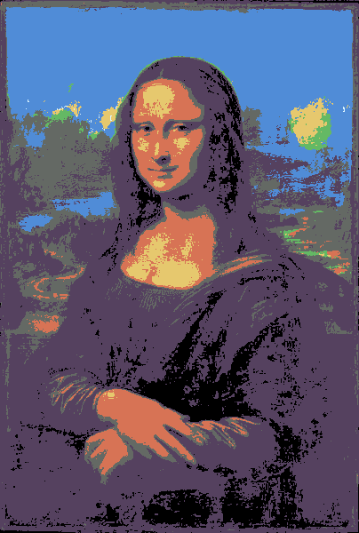

# anim8-gdx
Support for writing animated GIF, PNG8, and animated PNG (including full-color) from libGDX

There's been support for writing some image-file types from libGDX for a while, via its PixmapIO class.
PixmapIO can write full-color PNG files, plus the libGDX-specific CIM file format. It can't write any
animated image formats, nor can it write any indexed-mode images (which use a palette, and tend to be
smaller files). This library, anim8, allows libGDX applications to write animated GIF files, indexed-mode
PNG files, and animated PNG files (with either full-color or palette-based color). The API tries to
imitate the PixmapIO.PNG nested class, but supporting a palette needs some new methods. For a simple use
case, here's a `writeGif()` method that calls `render()` 20 times and screenshots each frame:

```java
public void writeGif() {
    final int frameCount = 20;
    Array<Pixmap> pixmaps = new Array<>(frameCount);
    for (int i = 0; i < frameCount; i++) {
// you could set the proper state for a frame here.

// you don't need to call render() in all cases, especially if you have Pixmaps already.
// this assumes you're calling this from a class that uses render() to draw to the screen.
        render();
// this gets a screenshot of the current window and adds it to the Array of Pixmap.
// there are two ways to do this; this is the older way, but it is deprecated in current libGDX: 
        pixmaps.add(ScreenUtils.getFrameBufferPixmap(0, 0, Gdx.graphics.getWidth(), Gdx.graphics.getHeight()));
// the newer way is only available in more-recent libGDX (I know 1.10.0 and 1.11.0 have it); it is not deprecated:
        // pixmaps.add(Pixmap.createFromFrameBuffer(0, 0, Gdx.graphics.getWidth(), Gdx.graphics.getHeight()));
    }
// AnimatedGif is from anim8; if no extra settings are specified it will calculate a 255-color palette from
// each given frame and use the most appropriate palette for each frame, dithering any colors that don't
// match. The other file-writing classes don't do this; PNG8 doesn't currently support a palette per-frame,
// while AnimatedPNG doesn't restrict colors to a palette. See Dithering Algorithms below for visual things
// to be aware of and choices you can make.
// You can also use FastGif in place of AnimatedGif if you don't target GWT; it may be a little faster.
    AnimatedGif gif = new AnimatedGif();
// you can write to a FileHandle or an OutputStream; here, the file will be written in the current directory.
// here, pixmaps is usually an Array of Pixmap for any of the animated image types.
// 16 is how many frames per second the animated GIF should play back at.
    gif.write(Gdx.files.local("AnimatedGif.gif"), pixmaps, 16);
}
```

The above code uses AnimatedGif, but could also use AnimatedPNG or PNG8 to write to an animated PNG (with full-color or
palette-based color, respectively). The FastGif, FastAPNG, and FastPNG8 options are also out there if you don't target
GWT, and they tend to be a little faster to run but produce larger files. There's also FastPNG, which is a replacement
for PixmapIO.PNG, and does tend to be faster than it as well. **None of the "Fast" image writers support flipping an
image vertically**, but all the non-"Fast" writers do support this; this may affect your choice.

If you are writing an image with a palette, such as a GIF or an indexed-mode PNG (called PNG8 here), the palette is
limited to using at most 255 opaque colors, plus one fully-transparent color. To adequately reduce an image to a smaller
palette, the general technique is to choose or generate a fitting palette, then to *dither* the image to break up solid
blocks of one color, and try to maintain or suggest any subtle gradients that were present before reduction. To choose
an existing palette, you use `PaletteReducer`'s `exact()` method, which takes an int array or similar collection of
RGBA8888 colors. You might want to get a small palette from [LoSpec](https://lospec.com/palette-list), for example.
To generate a palette that fits an existing image (or group of images), you use `PaletteReducer`'s `analyze()` method,
which takes a `Pixmap`, plus optionally a color threshold and a color count (most usage only needs a count of 256, but
the threshold can vary based on the image or images). Calling `analyze()` isn't incredibly fast, and it can take the
bulk of the time spent making an animated GIF if each frame has its own palette. Analyzing just once is sufficient for
many uses, though, and as long as the threshold is right, it can produce a nicely-fitting palette. Once you have called
`exact()` or `analyze()`, you can use the `PaletteReducer` in a `PNG8` or in an `AnimatedGif`, or on its own if you just
want to color-reduce `Pixmap`s. There are also two variants; `FastPalette`, which is like PaletteReducer but is not
compatible with GWT because it uses a different way of scanning through the input image, and `QualityPalette`, which is
also like PaletteReducer but uses a typically-higher-quality color difference calculation that is also slower. There's
more on this topic later, since this is a major focus of the library.

# Install

A typical Gradle dependency on anim8 looks like this (in the core module's dependencies for a typical libGDX project):
```groovy
dependencies {
  //... other dependencies are here, like libGDX 1.9.11 or higher
  // libGDX 1.11.0 is recommended currently, but versions as old as 1.9.11 work.
  api "com.github.tommyettinger:anim8-gdx:0.4.0"
}
```

You can also get a specific commit using JitPack, by following the instructions on
[JitPack's page for anim8](https://jitpack.io/#tommyettinger/anim8-gdx/da4f27d14b). (You usually want to select a recent
commit, unless you are experiencing problems with one in particular.)

A .gwt.xml file is present in the sources jar, and because GWT needs it, you can depend on the sources jar with
`implementation "com.github.tommyettinger:anim8-gdx:0.4.0:sources"`. The PNG-related code isn't available on GWT
because it needs `java.util.zip`, which is unavailable there, but PaletteReducer and AnimatedGif should both work,
as should QualityPalette. None of the "Fast" classes will work on GWT.
The GWT inherits line, which is needed in `GdxDefinition.gwt.xml` if no dependencies already have it, is:
```xml
<inherits name="com.github.tommyettinger.anim8" />
```

# Dithering Algorithms
You have a choice between several dithering algorithms if you write to GIF or PNG8; you can also avoid choosing one
entirely by using AnimatedPNG (it can use full color) or libGDX's PixmapIO.PNG (which isn't animated and has a
slightly different API). You could also use one of their alternatives, FastAPNG or FastPNG, which tend to write larger
files but do so more quickly.

  - NONE
    - No dither. Solid blocks of color only. Often looks bad unless the original image had few colors.
  - GRADIENT_NOISE
    - A solid choice of an ordered dither, though it may have visible artifacts in the form of zig-zag diagonal lines.
    - This changed slightly in 0.2.12, and should have less noticeable artifacts starting in that version.
      - It changed again in 0.3.10, and now essentially has no artifacts at the boundaries between large similar areas. 
    - A variant on Jorge Jimenez' Gradient Interleaved Noise.
    - This can look very good with higher dither strength, even when other dithers break down in quality.
    - This is very similar to ROBERTS dither, but is a little stronger, usually. 
  - PATTERN
    - A more traditional ordered dither that emphasizes accurately representing lightness changes.
    - Has a strong "quilt-like" square artifact that is more noticeable with small palette sizes.
    - Unusually slow to compute, but very accurate at preserving smooth shapes.
    - Very good at preserving shape, and the best at handling smooth gradients.
      - Changing the dither strength may have a small effect on lightness, but the effect
        to expect for PATTERN should be about the same as any other dither. This was different
        before version 0.2.8.
    - Uses Thomas Knoll's Pattern Dither, which is out-of-patent.
    - One of the best options when using large color palettes, and not very good for very small palettes.
  - DIFFUSION
    - This is Floyd-Steinberg error-diffusion dithering.
    - It tends to look very good in still images, and very bad in animations.
    - SCATTER and NEUE are mostly the same as this algorithm, but use blue noise to break up unpleasant patterns.
      - SCATTER or especially NEUE are usually preferred over this, as error-diffusion dithers go.
  - BLUE_NOISE
    - Blue noise, if you haven't heard the term, refers to a kind of sequence of values where low-frequency patterns
      don't appear at all, but mid- and high-frequency patterns are very common. 2D blue noise is common in graphics
      code, often as a texture but sometimes as a sequence of points; it is used here because most vertebrate eyes
      employ a blue-noise distribution for sensory cells, and this makes blue noise appear natural to the human eye.
    - This is mostly a typical blue-noise dither; it uses a different blue noise texture for each channel.
    - BLUE_NOISE looks good for many animations because the dithered pixels don't move around between frames. This is
      especially true for pixel art animations, where flat areas of one color should really stay that color.
    - I should probably credit Alan Wolfe for writing so many invaluable articles about blue noise,
      such as [this introduction](https://blog.demofox.org/2018/01/30/what-the-heck-is-blue-noise/).
      - This also uses a triangular-mapped blue noise texture, which means most of its pixels are in the middle of the
        range, and are only rarely very bright or dark. This helps the smoothness of the dithering.
      - Blue noise is also used normally by SCATTER and NEUE, as well as used strangely by CHAOTIC_NOISE.
    - This changed in 0.2.12, and handles smooth gradients better now. In version 0.3.5, it changed again to improve
      behavior on small palettes. It changed again in 0.3.8, 0.3.9, 0.3.13, and 0.3.14 to improve the appearance.
    - As of 0.3.14, this acts like GRADIENT_NOISE, has subtle artifacts that are less harsh, where GRADIENT_NOISE has a
      strong artifact that does improve how it handles lightness changes.
  - CHAOTIC_NOISE
    - Like BLUE_NOISE, but it will dither different frames differently, and looks much more dirty/splattered.
      - This is much "harsher" than BLUE_NOISE currently is. 
    - This is an okay algorithm here for animations, but BLUE_NOISE is much better, followed by NEUE or PATTERN.
    - This may be somewhat more useful when using many colors than when using just a few.
    - It's rather ugly with small palettes, and really not much better on large palettes.
  - SCATTER
    - A hybrid of DIFFUSION and BLUE_NOISE, this avoids some regular artifacts in Floyd-Steinberg by adjusting diffused
      error with blue-noise values. 
    - This used to be the default and can still sometimes be the best here.
    - Unlike DIFFUSION, this is somewhat suitable for animations, but fluid shapes look better with BLUE_NOISE or
      GRADIENT_NOISE, and subtle gradients in still images are handled best by PATTERN and well by NEUE and BLUE_NOISE.
    - You may want to use a lower dither strength with SCATTER if you encounter horizontal line artifacts; 0.75 or 0.5
      should be low enough to eliminate them (not all palettes will experience these artifacts).
  - NEUE
    - Another hybrid of DIFFUSION and BLUE_NOISE, this has much better behavior on smooth gradients than SCATTER, at the
      price of not producing many flat areas of solid colors (it prefers to dither when possible).
    - This is the default and often the best of the bunch.
    - The code for NEUE is almost the same as for SCATTER, but where SCATTER *multiplies* the current error by a blue
      noise value (which can mean the blue noise could have no effect if error is 0), NEUE always *adds* in
      triangular-mapped blue noise to each pixel at the same amount.
    - SCATTER, as well as all other dither algorithms here except BLUE_NOISE and PATTERN, tend to have banding on smooth
      gradients, while NEUE doesn't usually have any banding.
      - Subtle banding sometimes happened even with NEUE on gradients before 0.3.5, but this improved in that release.
    - NEUE may sometimes look "sandy" when there isn't a single good matching color for a flat span of pixels; if this
      is a problem, SCATTER can look better.
    - NEUE is the most likely algorithm to change in new versions, unless another new algorithm is added.
    - BLUE_NOISE, GRADIENT_NOISE, or ROBERTS will likely look better in pixel art animations, but NEUE can look better
      for still pixel art.
  - ROBERTS
    - This is another ordered dither, this time using the R2 sequence, a pattern discovered by Dr. Martin Roberts that
      distributes extra error well, but always adds some error to an image.
    - The dithering algorithm here is more complex than some other ordered dithers, and uses the fast `MathUtils.cos()`
      in libGDX with three different inputs, offset from each other, to add error to the RGB channels.
    - This adjusts each channel of a pixel differently, and the nearly-repeating nature of the R2 sequence makes very
      few patches of an image filled entirely with solid blocks of color. This makes it able
      to produce some color combinations via dithering that dithers like GRADIENT_NOISE, which affect all channels with
      the same error, can't produce with small palettes.
    - This is much like GRADIENT_NOISE, but milder, or BLUE_NOISE, but stronger.
    - This changed somewhat in versions 0.3.11, 0.3.13, and 0.3.14. 
  - WOVEN
    - This is an error-diffusion dither, like NEUE or SCATTER, but instead of using blue noise patterns to add error to
      the image, this uses the finer-grained "fuzzy" pattern from ROBERTS.
    - Unlike NEUE, SCATTER, or DIFFUSION, this uses a slightly different (offset) pattern for each RGB channel.
      - This can allow colors that wouldn't normally be produced easily by one of those three to appear here.
    - The artifacts in this may or may not be noticeable, depending on dither strength.
      - Increasing dither strength improves color accuracy, but also increases how obvious artifacts are.
  - DODGY
    - Another error-diffusion dither, this is like NEUE in that it mixed blue noise with error-diffusion, and like WOVEN
      in that it handles each RGB channel differently.
    - Unlike WOVEN, this doesn't have repetitive artifacts, but is noisier.
    - This dither algorithm is almost as good at reproducing colors as WOVEN, and is arguably preferable to it when the
      artifacts would be problematic.
    - It's better than NEUE at most things, but it isn't quite as smooth when the palette matches the image closely.
  - LOAF
    - A very simple, intentionally-low-fidelity ordered dither meant primarily for pixel art.
    - This has very obvious grid patterns, effectively repeating a 2x2 pixel area many times over similar color regions.
    - While PATTERN is much better at preserving curves, gradients, and lightness in general, it doesn't really look
      like hand-made pixel art, so this can be used as a lo-fi version of PATTERN.
  - Most algorithms have artifacts that stay the same across frames, which can be distracting for some palettes and some
    input images.
    - PATTERN and LOAF have obvious square grids.
    - BLUE_NOISE, SCATTER, ane NEUE have varying forms of a spongy blue noise texture.
    - GRADIENT_NOISE has a network of diagonal lines.
    - ROBERTS and WOVEN have a tilted grid pattern, approximately, of lighter or darker pixels. This can also sometimes
      look like scales or bubbles.
    - DIFFUSION tends to have its error corrections jump around between frames, which looks jarring.
    - CHAOTIC_NOISE has the opposite problem; it never keeps the same artifacts between frames, even if those frames are
      identical. This was also the behavior of NEUE in 0.3.0, but has since been changed.

You can set the strength of most of these dithers using PaletteReducer's, PNG8's, or AnimatedGif's
`setDitherStrength(float)` methods (use the method on the class that is producing output). For NONE,
there's no effect. For CHAOTIC_NOISE, there's almost no effect. For anything else, setting dither strength to close to 0
will approach the appearance of NONE, setting it close to 1.0 is the default, and strengths higher than 1 will make the
dither much stronger and may make the image less legible. NEUE, SCATTER, DODGY, and DIFFUSION sometimes have trouble
with very high dither strengths, though how much trouble varies based on the palette, and they also tend to look good
just before major issues appear. NEUE is calibrated to look best at dither strength 1.0, as is DODGY, but NEUE may stay
looking good at higher strengths for longer than SCATTER or DODGY do. The `setDitherStrength(float)` methods on PNG8 and
AnimatedGif were added in version 0.3.5 .

# Palette Generation

You can create a PaletteReducer object by manually specifying an exact palette (useful for pixel art), attempting to
analyze an existing image or animation (which can work well for large palette sizes, but not small sizes), or using the
default palette (made by DawnBringer and called "AURORA", it has 255 colors plus transparent). Of these, using
`analyze()` is the trickiest, and it generally should be permitted all 256 colors to work with. With `analyze()`, you
can specify the threshold between colors for it to consider adding one to the palette, and this is a challenging value
to set that depends on the image being dithered. Typically, between 50 and 600 are used, with higher values for smaller
or more diverse palettes (that is, ones with fewer similar colors to try to keep). Usually you will do just fine with
the default "AURORA" palette, or almost any practical 250+ color palette, because with so many colors it's hard to go
wrong. Creating a PaletteReducer without arguments, or calling `setDefaultPalette()` later, will set it to use AURORA.

As of version 0.3.3, GIF supports using a different palette for each frame of an
animation, analyzing colors separately for each frame. This supplements the previous behavior where a palette would
analyze all frames of an animation and find a 255-color palette that approximates the whole set of all frames
well-enough. PNG8 still uses the previous behavior, and you can use it with AnimatedGif by creating a PaletteReducer
with an `Array<Pixmap>` or calling `PaletteReducer.analyze(Array<Pixmap>)`. To analyze each frame separately, just make
sure the `palette` field of your `AnimatedGif` is null when you start writing a GIF. The `fastAnalysis` field on an
`AnimatedGif` object determines whether (if true) it uses a fast but approximate algorithm per frame, or (if false) it
uses the same analysis for each frame that it normally would for a still image. You can also create a `PaletteReducer`,
passing it an `Array<Pixmap>`, and assign that to the `palette` field; this is reasonably fast and also ensures every
frame will use the same palette (which means regions of solid color that don't change in the source won't change in the
GIF; this isn't true if `palette` is null).

Starting in version 0.3.7, you can use any of the `PaletteReducer.analyzeHueWise()` methods to analyze the palette of a
`Pixmap` or multiple `Pixmap`s. This approach works well with rather small palettes (about 16 colors) because it tries
to ensure some colors from every hue present in the image will be available in the palette. It stops being noticeably
better than `analyze()` at around 25-30 colors in a palette (this can vary based on the image), and is almost always
slower than `analyze()`. Thanks to [caramel](https://caramellow.dev/) for (very quickly) devising this algorithm for
palette construction. `analyzeHueWise()` is available in `FastPalette`, but not optimized any differently from in
`PaletteReducer`.

# Samples

Some animations, using 255 colors taken from the most-used in the animation (`analyze()`, which does well here
because it can use all the colors), are [here on Imgur](https://imgur.com/a/R7rFpED). These are all indexed-color
animated PNG files, produced with the AnimatedGif class and converted to animated PNG with a separate tool; using this
approach seems to avoid lossy compression on Imgur. Those use AnimatedGif's new fastAnalysis option; you can compare
them with fastAnalysis set to false [here on Imgur](https://imgur.com/a/YDsAOVy). Running with fastAnalysis set to true
(and also generating APNG images on the side) took about 40 seconds; with fastAnalysis false, about 129 seconds.

Some more .gif animations were made with the new fastAnalysis option; you can compare with fastAnalysis set to true
[here on Imgur](https://imgur.com/a/nDwYNcP), and with fastAnalysis false [here on Imgur](https://imgur.com/a/TiyBZex).
Like before, these were all converted to APNG so Imgur won't compress them, but they kept the same palette(s). Running
with fastAnalysis set to true took about 25 seconds; with false, over 130 seconds.

Some .gif animations that reduce the colors of the "flashy" animation shown are [here on Imgur, reduced to black and
white](https://imgur.com/a/1bkxPFH), and [here on Imgur, reduced to 4-color "green-scale"](https://imgur.com/a/5G7amXn).

And some .png animations, using full color (made with the AnimatedPNG class):


A more intense usage is to encode a high-color video as an indexed-color GIF; why you might do this, I don't know,
but someone probably wants videos as GIFs. There's some test footage here from
["Video Of A Market" by Olivier Polome](https://www.pexels.com/video/video-of-a-market-4236787/), which is freely
licensed without requirements. You can run the test "VideoConvertDemo" to generate various GIFs locally. I can't
reasonably host the large GIF files with Git.

Animated PNG can support full alpha as well (though file sizes can be large):


Anim8 also can be used to support writing non-animated GIF images and indexed-mode PNG images.
Here's a retouched version of the Mona Lisa,
[source on Wikimedia Commons here](https://commons.wikimedia.org/wiki/File:Mona_Lisa_Digitally_Restored.tif), and
various 8-color dithers using DawnBringer's carefully-chosen [DB8 palette](https://pixeljoint.com/forum/forum_posts.asp?TID=26050):

Original (full-color):


Neue (default):


Dodgy:



Woven:



Pattern:



Diffusion:



Gradient Noise:



Blue Noise:



Chaotic Noise:



Scatter:


Roberts:



Loaf:



None (no dither):



This doesn't call the `analyze()` method on the original image, and instead uses `exact()` with the aforementioned DB8
palette. If you are using `analyze()`, it works best when permitted all 255 colors available to it.

(If the Wikimedia Commons source file is deleted, the original is available in the history of
[this other image](https://commons.wikimedia.org/wiki/File:Leonardo_da_Vinci_-_Mona_Lisa_(Louvre,_Paris)FXD.tif)).

# License

The code in this project is licensed under Apache 2.0 (see [LICENSE](LICENSE)). The test images have their own licenses,
though most are public-domain. Of the test images used in the src/test/resources/ folder and its subfolders...

  - Cat.jpg is a portrait of my cat, Satchmo; the image is public domain, the cat is not.
  - Frog.jpg is a public-domain image of a red-eyed tree frog, [taken by Carey James Balboa](https://commons.wikimedia.org/wiki/File:Red_eyed_tree_frog_edit2.jpg).
  - Landscape.jpg is [Among the Sierra Nevada by Albert Bierstadt](https://commons.wikimedia.org/wiki/File:Albert_Bierstadt_-_Among_the_Sierra_Nevada,_California_-_Google_Art_Project.jpg), a public domain oil painting.
  - Mona_Lisa.jpg is also a public domain oil painting, this one the Mona Lisa by Leonardo da Vinci, and [remastered by pixel8tor](https://commons.wikimedia.org/wiki/File:Mona_Lisa_Digitally_Restored.tif) to reduce the appearance of damage over time.
  - Pixel_Art.png is a snippet of a texture atlas made from some [wargame pixel art I previously released into the public domain](https://opengameart.org/content/pixvoxel-revised-isometric-wargame-sprites). 
  - Anemone.png is just a noise texture I generated with a tool I wrote; the image is public domain.
  - Earring.jpg is another public domain oil painting, "Girl with a Pearl Earring" by Johannes Vermeer, [accessed here](https://commons.wikimedia.org/wiki/File:1665_Girl_with_a_Pearl_EarringFXD.jpg).
  - The animation frames in the subfolders globe, oklab, solids, tank, tree, and tyrant all come from other projects of mine; all of these frames are public domain.
  - The animation frames in market are freely licensed without requirements, and are from ["Video Of A Market" by Olivier Polome](https://www.pexels.com/video/video-of-a-market-4236787/).
    - Pexels doesn't provide a standard open source license other than saying they are free to use without requirements.
