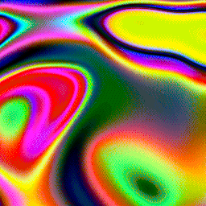
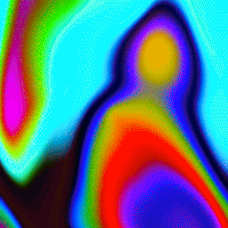
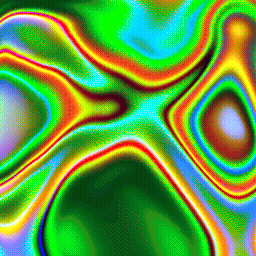
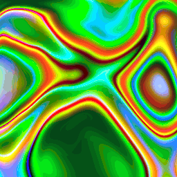

# anim8-gdx
Support for writing animated GIF, PNG8, and animated PNG (including full-color) from libGDX

There's been support for writing some image-file types from libGDX for a while, via its PixmapIO class.
PixmapIO can write full-color PNG files, plus the libGDX-specific CIM file format. It can't write any
animated image formats, nor can it write any indexed-mode images (which use a palette, and tend to be
smaller files). This library, anim8, allows libGDX applications to write animated GIF files, indexed-mode
PNG files, and animated PNG files (with either full-color or palette-based color). The API tries to
imitate the PixmapIO.PNG nested class, but supporting a palette needs some new methods. For a simple use
case, here's a `writeGif()` method that calls `render()` 20 times and screenshots each frame:

```java
public void renderGif() {
    final int frameCount = 20;
    Array<Pixmap> pixmaps = new Array<>(frameCount);
    for (int i = 0; i < frameCount; i++) {
        // you could set the proper state for a frame here.

        // you don't need to call render() in all cases, especially if you have Pixmaps already.
        render();
        // this gets a screenshot of the current window and adds it to the Array of Pixmap.
        pixmaps.add(ScreenUtils.getFrameBufferPixmap(0, 0, Gdx.graphics.getWidth(), Gdx.graphics.getHeight()));
    }
    // AnimatedGif is from anim8; if no extra settings are specified it will calculate a 255-color palette from
    // the given pixmaps and use that for all frames, dithering any colors that don't match.
    // see Quirks below for visual things to be aware of and choices you can take.
    AnimatedGif gif = new AnimatedGif();
    // you can write to a FileHandle or an OutputStream; here, the file will be written in the current directory.
    // here, pixmaps is usually an Array of Pixmap for any of the animated image types.
    // 16 is how many frames per second the animated GIF should play back at.
    gif.write(Gdx.files.local("AnimatedGif.gif"), pixmaps, 16);
}
```

The above code uses AnimatedGif, but could also use AnimatedPNG or PNG8 to write to an animated PNG (with full-color or
palette-based color, respectively).

# Install

A typical Gradle dependency on anim8 looks like this (in the core module's dependencies for a typical libGDX project):
```groovy
dependencies {
  //... other dependencies are here, like libGDX
  api 'com.github.tommyettinger:anim8-gdx:0.1.1'
}
```

You can also get a specific commit using JitPack, by following the instructions on
[JitPack's page for anim8](https://jitpack.io/#tommyettinger/anim8-gdx/e93fcd85db). 

Although a .gwt.xml file is present in the sources jar (`api 'com.github.tommyettinger:anim8-gdx:0.1.1:sources'`), using
any file-writing on GWT is a challenge that I haven't tackled yet. There is always a method available that can write to
an OutputStream, for any of the animated formats here, using:
```java
void write(OutputStream output, Array<Pixmap> frames, int fps)
```
This may be enough to write to a `ByteArrayOutputStream`, and use that somehow on GWT.

# Quirks
The default dithering algorithm used here is a variant on Thomas Knoll's pattern dither, which has been out-of-patent
since November 2019. Used verbatim, pattern dither forms a square grid of lighter or darker pixels where a color isn't
matched exactly. The first change here affects **Quirk Number One**: with pattern dither, some diagonal streaks may
appear due to how the square grid has been skewed to obscure that artifact. The second change relates to **Quirk Number
Two**: some partial gamma correction seems to significantly reduce the appearance of coarse dithering artifacts, but
also tends to bias the lightness balance toward brighter colors, sometimes partly washing out some details. You can set
the dithering algorithm to an alternative ordered dither, a variant on Jorge Jimenez' Gradient Interleaved Noise, using:
`setDitherAlgorithm(Dithered.DitherAlgorithm.GRADIENT_NOISE)`. This still has some diagonal lines that appear in it, but
they aren't usually as noticeable; there is however **Quirk Number Three**: with gradient noise dither, some smooth
gradients in the source image have rough sections where they move briefly away from the right color before correcting
their path. Gradient noise dither also tends to be, well, noisier. There's also the `Dithered.DitherAlgorithm.NONE`
algorithm, but it's only reasonable for some art styles that don't look good with any dither.

# Samples
Some .gif animations, using 255 colors:

Pattern dither:


Gradient dither:


Pattern dither:


Gradient dither:


Pattern dither:


Gradient dither:


No dither:


And some .png animations, using full color:


Animated PNG can support full alpha as well (though file sizes can be large):


