# anim8-gdx
Support for writing animated GIF, PNG8, and animated PNG (including full-color) from libGDX

There's been support for writing some image-file types from libGDX for a while, via its PixmapIO class.
PixmapIO can write full-color PNG files, plus the libGDX-specific CIM file format. It can't write any
animated image formats, nor can it write any indexed-mode images (which use a palette, and tend to be
smaller files). This library, anim8, allows libGDX applications to write animated GIF files, indexed-mode
PNG files, and animated PNG files (with either full-color or palette-based color). The API tries to
imitate the PixmapIO.PNG nested class, but supporting a palette needs some new methods. For a simple use
case, here's a `writeGif()` method that calls `render()` 20 times and screenshots each frame:

```java
public void writeGif() {
    final int frameCount = 20;
    Array<Pixmap> pixmaps = new Array<>(frameCount);
    for (int i = 0; i < frameCount; i++) {
        // you could set the proper state for a frame here.

        // you don't need to call render() in all cases, especially if you have Pixmaps already.
        // this assumes you're calling this from a class that uses render() to draw to the screen.
        render();
        // this gets a screenshot of the current window and adds it to the Array of Pixmap.
        pixmaps.add(ScreenUtils.getFrameBufferPixmap(0, 0, Gdx.graphics.getWidth(), Gdx.graphics.getHeight()));
    }
    // AnimatedGif is from anim8; if no extra settings are specified it will calculate a 255-color palette from
    // the given pixmaps and use that for all frames, dithering any colors that don't match.
    // see Dithering Algorithms below for visual things to be aware of and choices you can take.
    AnimatedGif gif = new AnimatedGif();
    // you can write to a FileHandle or an OutputStream; here, the file will be written in the current directory.
    // here, pixmaps is usually an Array of Pixmap for any of the animated image types.
    // 16 is how many frames per second the animated GIF should play back at.
    gif.write(Gdx.files.local("AnimatedGif.gif"), pixmaps, 16);
}
```

The above code uses AnimatedGif, but could also use AnimatedPNG or PNG8 to write to an animated PNG (with full-color or
palette-based color, respectively).

# Install

A typical Gradle dependency on anim8 looks like this (in the core module's dependencies for a typical libGDX project):
```groovy
dependencies {
  //... other dependencies are here, like libGDX 1.9.10 or higher
  api "com.github.tommyettinger:anim8-gdx:0.2.7"
}
```

You can also get a specific commit using JitPack, by following the instructions on
[JitPack's page for anim8](https://jitpack.io/#tommyettinger/anim8-gdx/57db9e3b6d). 

A .gwt.xml file is present in the sources jar, and because GWT needs it, you can depend on the sources jar with
`implementation "com.github.tommyettinger:anim8-gdx:0.2.7:sources"`. The PNG-related code isn't available on GWT because
it needs `java.util.zip`, which is unavailable there, but PaletteReducer and AnimatedGif should both work. The GWT
inherits line, which is needed in `GdxDefinition.gwt.xml` if no dependencies already have it, is:
```xml
``<inherits name="anim8" />
```

# Dithering Algorithms
You have a choice between several dithering algorithms if you write to GIF or PNG8; you can also avoid choosing one
entirely by using AnimatedPNG (it can use full color) or libGDX's PixmapIO.PNG (which isn't animated and has a slightly
different API).

  - NONE
    - No dither. Solid blocks of color only. Often looks bad unless the original image had few colors.
  - GRADIENT_NOISE
    - A solid choice of an ordered dither, though it may have visible artifacts in the form of zig-zag diagonal lines.
    - A variant on Jorge Jimenez' Gradient Interleaved Noise.
  - PATTERN
    - A more traditional ordered dither that's been skewed, so it doesn't have square artifacts.
    - Unusually slow to compute, but very accurate at preserving smooth shapes.
      - PATTERN dither changed to a 4x2 dither with skew instead of a 4x4 between in version 0.2.4,
        which sped it up somewhat, but it remains noticeably slower than other dithering algorithms.
    - Doesn't preserve lightness very well, but is very good at preserving shape.
      - Unlike other dither types, changing the dither strength affects lightness here, but not very
        strongly in version 0.2.4 and later.
    - A variant on Thomas Knoll's Pattern Dither, which is out-of-patent.
  - DIFFUSION
    - This is Floyd-Steinberg error-diffusion dithering.
    - It tends to look very good in still images, and very bad in animations.
    - SCATTER is mostly the same as this algorithm, but uses blue noise to break up unpleasant patterns.
  - BLUE_NOISE
    - Blue noise, if you haven't heard the term, refers to a kind of sequence of values where low-frequency patterns
      don't appear at all, but mid- and high-frequency patterns are very common. 2D blue noise is common in graphics
      code, often as a texture but sometimes as a sequence of points; it is used here because most vertebrate eyes
      employ a blue-noise distribution for sensory cells, and this makes blue noise appear natural to the human eye.
    - Not the typical blue-noise dither; this incorporates a checkerboard pattern as well as a 64x64 blue noise texture.
    - I should probably credit Alan Wolfe for writing so many invaluable articles about blue noise.
    - This may have some issues when the palette is very small; it may not dither strongly enough by default for small
      palettes, which makes it look closer to NONE in those cases. It does fine with large palettes.
  - CHAOTIC_NOISE
    - Like BLUE_NOISE, but it will dither different frames differently, and can look somewhat more chaotic.
    - This is probably the second-best algorithm here for animations, after SCATTER.
    - This may be more useful when using many colors than when using just a few.
  - SCATTER
    - A hybrid of DIFFUSION and BLUE_NOISE, this avoids some regular artifacts in Floyd-Steinberg by adjusting diffused
      error with blue-noise values. 
    - This is the default and often the best of the bunch.
    - Unlike DIFFUSION, this is quite suitable for animations, but some fluid shapes look better with CHAOTIC_NOISE or
      GRADIENT_NOISE, and subtle gradients are handled best by PATTERN.

You can set the strength of some of these dithers using PaletteReducer's `setDitherStrength(float)` method. For NONE,
there's no effect. For CHAOTIC_NOISE, there's almost no effect. For anything else, setting dither strength to close to 0
will approach the appearance of NONE, while setting it close to 1.0 (or higher) will make the dither much stronger and
may make the image less legible.

# Samples
Some .gif animations, using 255 colors taken from the most-used in the animation:

Pattern dither:


Gradient dither:


Diffusion dither (Floyd-Steinberg):


Blue Noise dither:


Chaotic Noise dither:

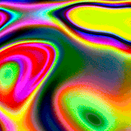

Scatter dither:


No dither:

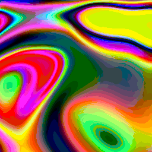

Pattern dither:

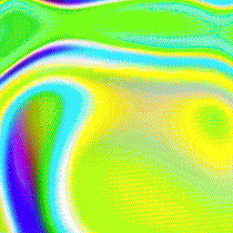

Gradient dither:


Diffusion dither (Floyd-Steinberg):

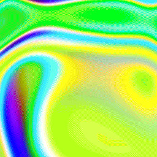

Blue Noise dither:

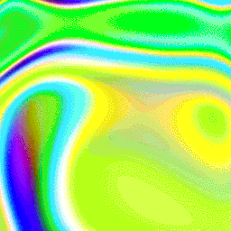

Chaotic Noise dither:

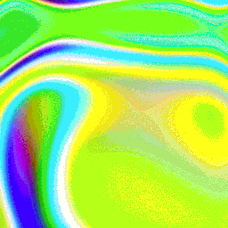

Scatter dither:


No dither:

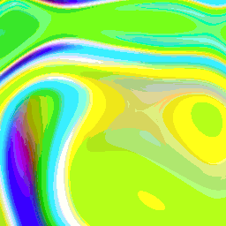

Some .gif animations that reduce the colors of the first two animations shown:

Black and white pattern dither:


Black and white gradient dither:

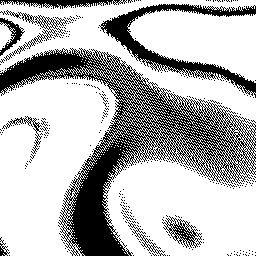

Black and white diffusion dither (Floyd-Steinberg):

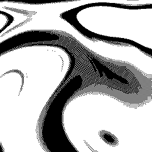

Black and white blue noise dither:


Black and white scatter dither:


Black and white no dither:

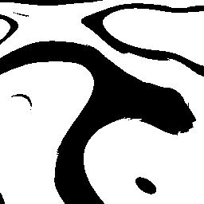

4-color green-scale pattern dither:

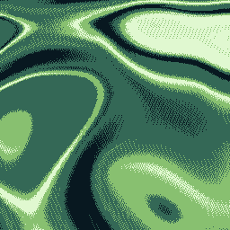

4-color green-scale gradient dither:

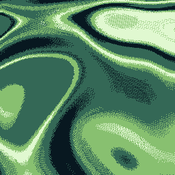

4-color green-scale diffusion dither (Floyd-Steinberg):

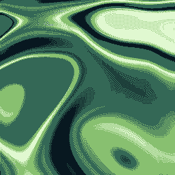

4-color green-scale blue noise dither:

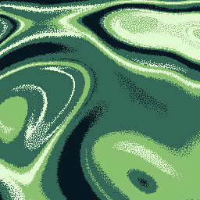

4-color green-scale scatter dither:

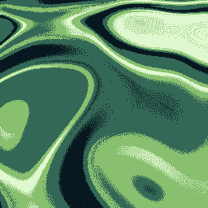

And some .png animations, using full color:


A more intense usage is to encode a high-color video as an indexed-color GIF; why you might do this, I don't know,
but someone probably wants videos as GIFs. The images here are 90 frames from
["Video Of A Market" by Olivier Polome](https://www.pexels.com/video/video-of-a-market-4236787/), which is freely
licensed without requirements. Note that the following animations are limited to 255 colors, and the mp4 video
they use as a source has some block artifacts. [You can see the effects of different dither algorithms on the same video in this folder](https://github.com/tommyettinger/anim8-gdx/tree/master/images/market).

Animated PNG can support full alpha as well (though file sizes can be large):


Anim8 also can be used to support writing non-animated GIF images and indexed-mode PNG images.
Here's a retouched version of the Mona Lisa,
[source on Wikimedia Commons here](https://commons.wikimedia.org/wiki/File:Mona_Lisa_Digitally_Restored.tif), and
various 15-color dithers using a palette derived from the most frequent and different colors in the original:

Original (full-color):


Pattern:

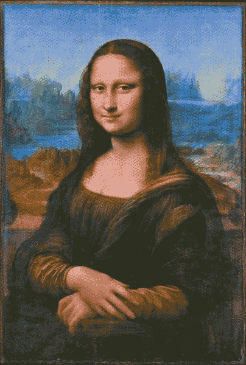

Diffusion:

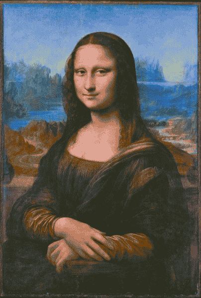

Gradient Noise:

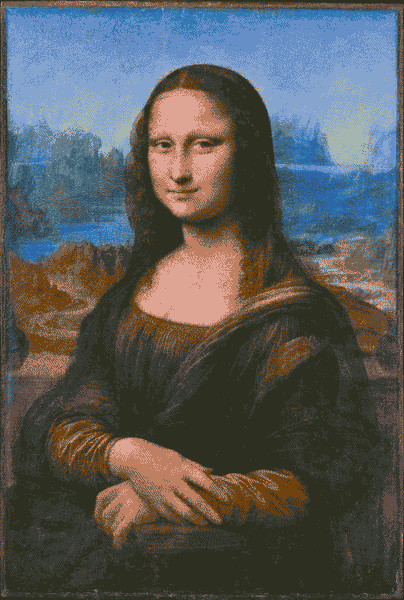

Blue Noise:


Chaotic Noise:

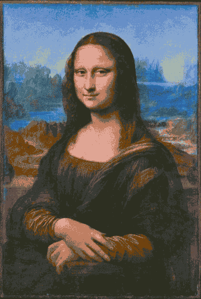

Scatter:

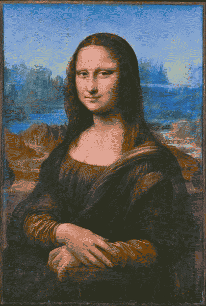

None (no dither):


The analysis step that PaletteReducer performs prefers the most frequent colors in the image, and the Mona Lisa has
mostly dark gray, blue, and brown-to-flesh-tone colors. As such, the small amounts of green get forgotten when color
count is low.

(If the Wikimedia Commons source file is deleted, the original is available in the history of
[this other image](https://commons.wikimedia.org/wiki/File:Leonardo_da_Vinci_-_Mona_Lisa_(Louvre,_Paris)FXD.tif)).
