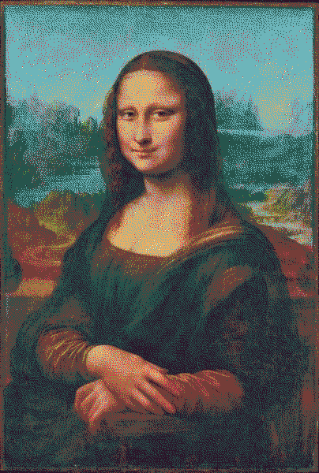
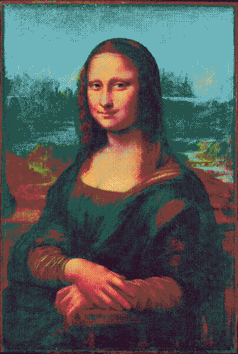
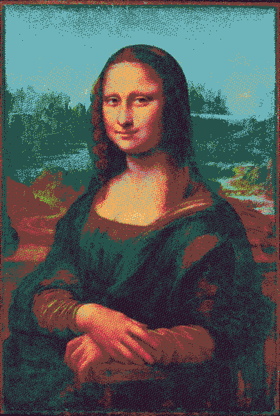
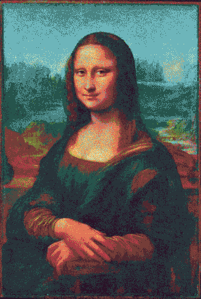
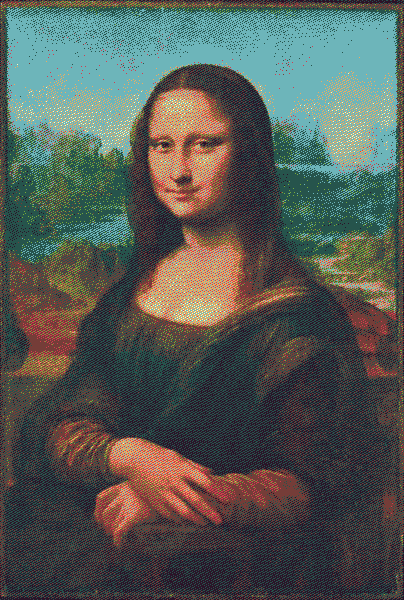

# anim8-gdx
Support for writing animated GIF, PNG8, and animated PNG (including full-color) from libGDX

There's been support for writing some image-file types from libGDX for a while, via its PixmapIO class.
PixmapIO can write full-color PNG files, plus the libGDX-specific CIM file format. It can't write any
animated image formats, nor can it write any indexed-mode images (which use a palette, and tend to be
smaller files). This library, anim8, allows libGDX applications to write animated GIF files, indexed-mode
PNG files, and animated PNG files (with either full-color or palette-based color). The API tries to
imitate the PixmapIO.PNG nested class, but supporting a palette needs some new methods. For a simple use
case, here's a `writeGif()` method that calls `render()` 20 times and screenshots each frame:

```java
public void writeGif() {
    final int frameCount = 20;
    Array<Pixmap> pixmaps = new Array<>(frameCount);
    for (int i = 0; i < frameCount; i++) {
// you could set the proper state for a frame here.

// you don't need to call render() in all cases, especially if you have Pixmaps already.
// this assumes you're calling this from a class that uses render() to draw to the screen.
        render();
// this gets a screenshot of the current window and adds it to the Array of Pixmap.
// there are two ways to do this; this way works in older libGDX versions, but it is deprecated in current libGDX: 
//        pixmaps.add(ScreenUtils.getFrameBufferPixmap(0, 0, Gdx.graphics.getWidth(), Gdx.graphics.getHeight()));
// the newer way is only available in more-recent libGDX (I know 1.10.0 through 1.12.0 have it); it is not deprecated:
        pixmaps.add(Pixmap.createFromFrameBuffer(0, 0, Gdx.graphics.getWidth(), Gdx.graphics.getHeight()));
    }
// AnimatedGif is from anim8; if no extra settings are specified it will calculate a 255-color palette from
// each given frame and use the most appropriate palette for each frame, dithering any colors that don't
// match. The other file-writing classes don't do this; PNG8 doesn't currently support a palette per-frame,
// while AnimatedPNG doesn't restrict colors to a palette. See Dithering Algorithms below for visual things
// to be aware of and choices you can make.
// You can also use FastGif in place of AnimatedGif; it may be a little faster, but might not have great color quality.
    AnimatedGif gif = new AnimatedGif();
// you can write to a FileHandle or an OutputStream; here, the file will be written in the current directory.
// here, pixmaps is usually an Array of Pixmap for any of the animated image types.
// 16 is how many frames per second the animated GIF should play back at.
    gif.write(Gdx.files.local("AnimatedGif.gif"), pixmaps, 16);
}
```

The above code uses AnimatedGif, but could also use AnimatedPNG or PNG8 to write to an animated PNG (with full-color or
palette-based color, respectively). The FastGif, and FastPNG8 options are also out there, and they tend to be a little
faster to run but produce larger files. There's also FastPNG, which is a replacement for PixmapIO.PNG, and does tend to
be faster than it as well while producing full-color non-animated PNG images.

If you are writing an image with a palette, such as a GIF or an indexed-mode PNG (called PNG8 here), the palette is
limited to using at most 255 opaque colors, plus one fully-transparent color. To adequately reduce an image to a smaller
palette, the general technique is to choose or generate a fitting palette, then to *dither* the image to break up solid
blocks of one color, and try to maintain or suggest any subtle gradients that were present before reduction. To choose
an existing palette, you use `PaletteReducer`'s `exact()` method, which takes an int array or similar collection of
RGBA8888 colors. You might want to get a small palette from [LoSpec](https://lospec.com/palette-list), for example. You could go through the steps
of downloading a .hex file (or another text palette) and converting it to a Java `int[]` syntax... or you could simply
get a palette image (or any image that only uses the palette you want, with 255 colors or fewer) and call
`PaletteReducer.colorsFrom(Pixmap)` to get an int array to pass to `exact()`.

To generate a palette that fits an existing many-color image (or group of images), you use `PaletteReducer`'s
`analyze()` method, which takes a `Pixmap`, plus optionally a color threshold and a color count (most usage only needs a
count of 256, but the threshold can vary based on the image or images). Calling `analyze()` isn't incredibly fast, and
it can take the bulk of the time spent making an animated GIF if each frame has its own palette. Analyzing just once is
sufficient for many uses, though, and as long as the threshold is right, it can produce a nicely-fitting palette. Once
you have called `exact()` or `analyze()`, you can use the `PaletteReducer` in a `PNG8` or in an `AnimatedGif`, or on its
own if you just want to color-reduce `Pixmap`s. There are also two variants; `FastPalette`, which is like PaletteReducer
but uses a possibly-faster and lower-quality way of comparing colors, and `QualityPalette`, which is also like
PaletteReducer but uses a typically-higher-quality color difference calculation that is also slower. There's more on
this topic later, since this is a major focus of the library.

# Install

A typical Gradle dependency on anim8 looks like this (in the core module's dependencies for a typical libGDX project):
```groovy
dependencies {
  //... other dependencies are here, like libGDX 1.9.11 or higher
  // libGDX 1.13.1 is recommended currently, but versions as old as 1.9.11 work.
  api "com.github.tommyettinger:anim8-gdx:0.5.2"
}
```

You can also get a specific commit using JitPack, by following the instructions on
[JitPack's page for anim8](https://jitpack.io/#tommyettinger/anim8-gdx/da4f27d14b). (You usually want to select a recent
commit, unless you are experiencing problems with one in particular.)

A .gwt.xml file is present in the sources jar, and some of this works on GWT. The PNG-related code isn't available on
GWT because it needs `java.util.zip`, which is unavailable there, but PaletteReducer and AnimatedGif should both work,
as should `QualityPalette`. The classes `FastGif` and `FastPalette` should work on GWT, but no other "Fast" classes
will. The GWT inherits line, which is needed in `GdxDefinition.gwt.xml`, is:
```xml
<inherits name="com.github.tommyettinger.anim8" />
```

If you do use this on GWT, the GWT build.gradle file also needs a dependency on anim8-gdx's sources:

```groovy
  implementation "com.github.tommyettinger:anim8-gdx:0.5.2:sources"
```

# Dithering Algorithms
You have a choice between several dithering algorithms if you write to GIF or PNG8; you can also avoid choosing one
entirely by using AnimatedPNG (it uses full color) or libGDX's PixmapIO.PNG (which isn't animated and has a
slightly different API). You could also use FastPNG, which is like PixmapIO's code but tends to write larger files, do
so more quickly, and avoid losing any color information.

All dithering algorithms except NONE, CHAOTIC_NOISE, and PATTERN changed appearance significantly in version 0.5.0
because that version includes at least an attempt at gamma-correcting the images, and earlier versions did not. That
means 0.5.0 should usually have closer lightness in the dither to what the original image had, relative to earlier
anim8-gdx versions. History from ancient versions of anim8-gdx has been removed from this section for clarity.

  - NONE
    - No dither. Solid blocks of color only. Often looks bad unless the original image had few colors.
  - GRADIENT_NOISE
    - A solid choice of an ordered dither, though it may have visible artifacts in the form of zigzag diagonal lines.
    - A variant on Jorge Jimenez' Gradient Interleaved Noise.
    - This is very similar to ROBERTS dither, but is a little stronger, usually, with more light-and-dark variation. 
  - PATTERN
    - A more traditional ordered dither that emphasizes accurately representing lightness changes.
    - Has a strong "quilt-like" square artifact that is more noticeable with small palette sizes.
    - Unusually slow to compute, but very accurate at preserving smooth shapes.
    - Very good at preserving shape, and the best at handling smooth gradients.
    - While this should be good for animations, it isn't in a common case: GIFs that get lossy-recompressed look absolutely horrible with this dither, but fine with any error-diffusion dithers.
      - This uses case shows up most often right now when GIFs are embedded in a Discord message, because Discord does (very reasonably) try to limit bandwidth from heavy GIF files by recompressing them in a lossy way.
    - Uses Thomas Knoll's Pattern Dither, which is out-of-patent.
    - One of the best options when using large color palettes, and not very good for very small palettes.
  - DIFFUSION
    - This is Floyd-Steinberg error-diffusion dithering.
    - It tends to look very good in still images, and very bad in animations.
    - BURKES is essentially a variant on this type of error diffusion, though it often looks better.
    - SCATTER and NEUE are mostly the same as this algorithm, but use blue noise to break up unpleasant patterns.
    - WOVEN dither uses a repeating pattern reminiscent of braids or hexagons to break up patterns, but introduces its own.
    - WREN dither uses both blue noise and the WOVEN pattern, so most patterns it would add get broken up.
    - Any of the dither algorithms based on this will probably look better than this will.
  - BLUE_NOISE
    - Blue noise as a concept is a little tricky to explain.
      - It refers to "noise" in the sense of "signal versus noise," not anything audio-related here.
      - When noise is considered "white", all frequencies show up equally often, so there are no recognizably similar large-scale patterns (which are caused by low frequencies changing an area very slowly) nor any repeating small-scale patterns (caused by high frequencies).
          - An example looks like this: 
      - When noise is considered "blue", there are no large-scale patterns that can be picked up by a human or computer, because low frequencies don't make much or any contribution to the noise.
      - In the case of a texture, a "blue noise texture" has no large splotches of the same color, and is always changing between nearby pixels.
        - An example looks like this:  
      - The eyes of many animals (including humans) have light-sensing rod cells distributed in a blue-noise pattern inside the eye.
        - This means that when our eyes see textures with only a blue noise distribution to artifacts, those artifacts appear more natural than they would otherwise.
        - Contrast this with seeing textures that have an artifact like, say, a bright ring of pixels appearing every 10 pixels horizontally and every 10 pixels vertically; this would be very noticeable!
    - This is not a typical blue-noise dither; it uses a different blue noise texture for each channel but also incorporates a fine-resolution checkerboard of light and dark.
      - This breaks up patterns from the blue noise, but can look quite artifact-laden. 
    - BLUE_NOISE looks good for many animations because the dithered pixels don't move around between frames. This is
      especially true for pixel art animations, where flat areas of one color should really stay that color.
    - I should probably credit Alan Wolfe for writing so many invaluable articles about blue noise,
      such as [this introduction](https://blog.demofox.org/2018/01/30/what-the-heck-is-blue-noise/).
      - This also uses a triangular-mapped blue noise texture, which means most of its pixels are in the middle of the
        range, and are only rarely very bright or dark. This helps the smoothness of the dithering.
      - Blue noise is also used normally by SCATTER, NEUE, WREN, and BLUNT, as well as used strangely by CHAOTIC_NOISE.
    - If BLUE_NOISE doesn't look quite right for your images, you can try BLUNT, which is very close, but noisier with less checkerboard effect.
  - CHAOTIC_NOISE
    - Like BLUE_NOISE, but it will dither different frames differently, and looks much more dirty/splattered.
      - This is much "harsher" than BLUE_NOISE currently is. 
    - This is an okay algorithm here for animations, but GOURD, ROBERTS, and BLUE_NOISE are much better, followed by PATTERN.
    - Well, not really okay. It's quite hideous. Use this when you want an anti-aesthetic choice for a bad dither.
  - SCATTER
    - A hybrid of DIFFUSION and BLUE_NOISE, this avoids some regular artifacts in Floyd-Steinberg by adjusting diffused
      error with blue-noise values.
    - This used to be the default, but newer dithers based on the same idea, including NEUE, DODGY, WOVEN, WREN,
      OVERBOARD, OCEANIC, and SEASIDE, are all similar and generally better.
  - NEUE
    - Another hybrid of DIFFUSION and BLUE_NOISE, this has much better behavior on smooth gradients than SCATTER, at the
      price of not producing many flat areas of solid colors (it prefers to dither when possible).
    - The code for NEUE is almost the same as for SCATTER, but where SCATTER *multiplies* the current error by a blue
      noise value (which can mean the blue noise could have no effect if error is 0), NEUE always *adds* in
      triangular-mapped blue noise to each pixel at the same amount.
    - SCATTER, as well as many other dither algorithms here, tend to have banding on smooth
      gradients, while NEUE doesn't usually have any banding.
    - NEUE may sometimes look "sandy" when there isn't a single good matching color for a flat span of pixels; if this
      is a problem, SCATTER can look better.
    - This used to be the default, but the new default WREN handles perceived color quite a bit better.
    - BLUE_NOISE, GRADIENT_NOISE, GOURD, PATTERN, or ROBERTS will likely look better in pixel art animations, but NEUE
      can look better for still pixel art.
  - ROBERTS
    - This is another ordered dither, this time using the R2 sequence, a pattern discovered by Dr. Martin Roberts that
      distributes extra error well, but always adds some error to an image.
    - The dithering algorithm here is more complex than some other ordered dithers, and uses a triangle wave with three
      different inputs, offset from each other, to add error to the RGB channels.
    - This adjusts each channel of a pixel differently, and the nearly-repeating nature of the R2 sequence makes very
      few patches of an image filled entirely with solid blocks of color. This makes it able
      to produce some color combinations via dithering that dithers like GRADIENT_NOISE, which affect all channels with
      the same error, can't produce with small palettes.
    - This is much like GRADIENT_NOISE, but somewhat milder, or BLUE_NOISE, but much milder.
    - You may want to also consider WOVEN or WREN if you like the effect this produces, though this is better for animations.
  - WOVEN
    - This is an error-diffusion dither, like NEUE or SCATTER, but instead of using blue noise patterns to add error to
      the image, this uses the finer-grained "fuzzy" pattern from ROBERTS and its R2 sequence.
    - Unlike NEUE, SCATTER, or DIFFUSION, this uses a slightly different (offset) pattern for each RGB channel.
      - This can allow colors that wouldn't normally be produced easily by one of those three to appear here.
    - The artifacts in this may or may not be noticeable, depending on dither strength.
      - Increasing dither strength improves color accuracy, but also increases how obvious artifacts are.
  - DODGY
    - Another error-diffusion dither, this is like NEUE in that it mixed blue noise with error-diffusion, and like WOVEN
      in that it handles each RGB channel differently.
    - Unlike WOVEN, this doesn't have repetitive artifacts, but is noisier.
    - This dither algorithm is almost as good at reproducing colors as WOVEN, and is arguably preferable to it when the
      artifacts would be problematic.
    - It's better than NEUE at most things, but it isn't quite as smooth when the palette matches the image closely.
    - This is similar to WREN, except that WREN also incorporates the braid-like R2 sequence. OVERBOARD incorporates
      even more, though it can go too far and add artifacts.
  - LOAF
    - A very simple, intentionally-low-fidelity ordered dither meant primarily for pixel art.
    - This has very obvious grid patterns, effectively repeating a 2x2 pixel area many times over similar color regions.
    - You will see fine-resolution checkerboard patterns very often here.
    - While PATTERN is much better at preserving curves, gradients, and lightness in general, it doesn't really look like hand-made pixel art, so this can be used as a lo-fi version of PATTERN.
    - LOAF does also work well for some animations, especially when compared to any error-diffusion dithers (which can have the error change wildly between frames).
    - Consider the other dithers GOURD and BANTER if this doesn't fit your needs but you still want an ordered, grid-like dither.
  - WREN
    - A complex mix of error diffusion a la DIFFUSION, the R2 sequence from ROBERTS, and blue noise to break up the patterns from those.
    - This preserves hue almost as well as WOVEN, but is better than WOVEN at preserving lightness, and has fewer noticeable artifacts.
    - This adjusts each channel separately, like how DODGY and WOVEN work but not like the older NEUE or SCATTER.
    - There are still use cases for the similar DODGY and WOVEN dithers.
      - DODGY can be noisier, but if even slight repetitive artifacts are an issue, that noise becomes an advantage relative to WREN.
      - WOVEN typically preserves hue more accurately because the predictable nature of its repetitive artifact happens to align with its error-diffusion, improving perceived color when viewed from a distance.
    - This used to be the default, OVERBOARD replaced it, and now after some small changes to WREN, it is back as the default dither.
  - OVERBOARD
    - You thought WREN was complicated? Think again. OVERBOARD takes a Burkes error diffusion dither and mixes in added error from variants on the R2 sequence, blue noise, and XOR-mod patterns into each channel of each pixel.
      - XOR-mod patterns are often seen in very small blocks of code, like Tweets or demoscene code, and have primarily diagonal lines in unpredictable patterns.
    - It doesn't use its whole repertoire for every channel, and selects which variants will add error using a simple ordered grid pattern.
    - This adjusts each channel separately, and is close in how its code works to WREN (which also does this).
    - This tends to have fewer artifacts, if any, at high dither strength. This is true relative to most dithers here.
    - It also tends to be smoother than WREN, without any "rough surface" appearance, but may add artifacts where there were none.
    - It is not as good at reproducing unusual colors (ones very different from what the palette contains), when compared to WREN or especially to WOVEN.
    - It can have worse banding than other dithers of its type, like WREN.
  - BURKES
    - This is fairly simple error diffusion dither than nonetheless has very smooth results.
    - This is more faithful to the original error diffusion algorithm, which may explain why it looks better that Floyd-Steinberg (DIFFUSION) much of the time.
    - Artifacts tend to be 45-degree lines, if they show up at all.
    - Because this doesn't introduce extra noise, it will look very good with larger palettes, since the dithering should bring the colors to where they should be and not where the noise would offset them.
  - OCEANIC
    - A slight tweak on BURKES that uses blue noise to make small changes to the error diffusion pattern.
    - This mostly is an improvement on existing dithers when BURKES has noticeable artifacts, but it is rather good in general, as well.
    - Where diagonal artifacts would have appeared with BURKES, this tends to show soft/fuzzy noise, but not over a large area.
    - If no significant issues are found with OCEANIC, then either OCEANIC or the very similar SEASIDE algorithm may
      become the default dither, because they have a good balance of softness and accuracy.
      - I went with WREN though, because some of its results were really excellent and none looked "off" in general. 
  - SEASIDE
    - Very close to OCEANIC, this also uses blue noise to adjust the error diffusion; the difference is that it uses different blue noise textures for each RGB channel.
    - This sometimes has better color reproduction than OCEANIC, but also sometimes doesn't. It's hard to tell why.
    - Any repetitive small-scale patterns in this are likely to be different from those in OCEANIC, or absent entirely.
    - When two colors are nearly-equally matched in a palette, OCEANIC tends to show a 1px checkerboard, whereas SEASIDE shows a more coarse-grained texture.
  - GOURD
    - Somewhere between PATTERN and LOAF, this is an ordered dither using a 8x8 grid it applies rather directly as added noise.
    - This is quite a bit faster than PATTERN, and gets almost-similar results.
    - This dither is especially sensitive to changes in ditherStrength. 1.0f is recommended for most purposes, or maybe up to 0.25f less or more.
    - Like LOAF, this is meant to be good for animations.
    - This is similar to BANTER, but GOURD doesn't use the "triangular-mapped" grid that BANTER does.
  - BLUNT
    - Very close to BLUE_NOISE, but with the checkerboard effect diminished and noise increased.
    - This is an ordered dither, so it's meant to be good for animations, but it really does need a lot of colors in the palette to look decent.
    - The noisiness of three blue noise textures (one per RGB channel) is much less distracting for large palettes.
    - This handles smooth color gradients rather well.
  - BANTER
    - This is derived from BLUNT but uses just one triangular-mapped Bayer Matrix instead of three triangular-mapped blue noise textures.
    - It has much more noticeable grid artifacts, but these quickly disappear as strength is reduced (but lightness gets less accurate).
    - This still may have some grid artifacts visible even with large palettes, but pixel art tends to make them less noticeable.
    - Gradients actually are handled pretty well here, as are animations.
    - This is also an ordered dither.
  - Most algorithms have artifacts that stay the same across frames, which can be distracting for some palettes and some
    input images.
    - PATTERN, LOAF, GOURD, and BANTER have obvious square grids.
    - BLUE_NOISE, SCATTER, NEUE, OVERBOARD, and BLUNT have varying forms of a spongy blue noise texture. OVERBOARD shows this less.
    - DIFFUSION may have parallel vertical bars, and BURKES may have 45-degree lines appear.
    - GRADIENT_NOISE has a network of diagonal lines.
    - ROBERTS, WOVEN, and WREN have a tilted grid pattern, approximately, of lighter or darker pixels. This can also
      sometimes look like scales, bubbles, or braids. WREN shows this artifact less noticeably than the others.
    - DIFFUSION and BURKES tend to have their error corrections jump around between frames, which looks jarring.
      - BURKES has this less dramatically than DIFFUSION, and OCEANIC is meant to avoid this. 
    - CHAOTIC_NOISE has the opposite problem; it never keeps the same artifacts between frames, even if those frames are
      identical.
    - For very small palettes, OVERBOARD can have noticeable diagonal lines from the Burkes dither it is based on. So
      can BURKES, of course, but OCEANIC and SEASIDE do a good job at avoiding these.

You can set the strength of most of these dithers using PaletteReducer's, PNG8's, or AnimatedGif's
`setDitherStrength(float)` methods (use the method on the class that is producing output). For NONE,
there's no effect. For CHAOTIC_NOISE, there's almost no effect. For anything else, setting dither strength to close to 0
will approach the appearance of NONE, setting it close to 1.0 is the default, and strengths higher than 1 will make the
dither much stronger and may make the image less legible. NEUE, SCATTER, DODGY, and DIFFUSION sometimes have trouble
with very high dither strengths, though how much trouble varies based on the palette, and they also tend to look good
just before major issues appear. NEUE is calibrated to look best at dither strength 1.0, as is DODGY, but NEUE may stay
looking good at higher strengths for longer than SCATTER or DODGY do. GOURD is quite sensitive to changes in
ditherStrength; it usually doesn't look very good with strength less than 0.75f.

# Palette Generation

You can create a PaletteReducer object by manually specifying an exact palette (useful for pixel art), attempting to
analyze an existing image or animation (which can work well for large palette sizes, but not small sizes), or using the
default palette (called "SNUGGLY", it nicely fits 255 colors plus transparent). Of these, using
`analyze()` is the trickiest, and it generally should be permitted all 256 colors to work with. With `analyze()`, you
can specify the threshold between colors for it to consider adding one to the palette, and this is a challenging value
to set that depends on the image being dithered. Typically, between 50 and 200 are used, with higher values for smaller
or more diverse palettes (that is, ones with fewer similar colors to try to keep). Usually you will do just fine with
the default "SNUGGLY" palette, or almost any practical 250+ color palette, because with so many colors it's hard to go
wrong. Creating a PaletteReducer without arguments, or calling `setDefaultPalette()` later, will set it to use SNUGGLY.

GIF supports using a different palette for each frame of an
animation, analyzing colors separately for each frame. This supplements the previous behavior where a palette would
analyze all frames of an animation and find a 255-color palette that approximates the whole set of all frames
well-enough. PNG8 still uses the previous behavior, and you can use it with AnimatedGif by creating a PaletteReducer
with an `Array<Pixmap>` or calling `PaletteReducer.analyze(Array<Pixmap>)`. To analyze each frame separately, just make
sure the `palette` field of your `AnimatedGif` is null when you start writing a GIF. The `fastAnalysis` field on an
`AnimatedGif` object determines whether (if true) it uses a fast but approximate algorithm per frame, or (if false) it
uses the same analysis for each frame that it normally would for a still image. You can also create a `PaletteReducer`,
passing it an `Array<Pixmap>`, and assign that to the `palette` field; this is reasonably fast and also ensures every
frame will use the same palette (which means regions of solid color that don't change in the source won't change in the
GIF; this isn't true if `palette` is null).

You can use any of the `PaletteReducer.analyzeHueWise()` methods to analyze the palette of a
`Pixmap` or multiple `Pixmap`s. This approach works well with rather small palettes (about 16 colors) because it tries
to ensure some colors from every hue present in the image will be available in the palette. It stops being noticeably
better than `analyze()` at around 25-30 colors in a palette (this can vary based on the image), and is almost always
slower than `analyze()`. Thanks to [caramel](https://caramellow.dev/) for (very quickly) devising this algorithm for
palette construction. `analyzeHueWise()` is available in `FastPalette`, but not optimized any differently from in
`PaletteReducer`.

You can use `PaletteReducer.analyzeReductive()` as an alternative to
`PaletteReducer.analyze()` or other ways. It does rather well on small palettes (such as a 16-color reduction). This
analysis involves trimming down a huge 1024-color palette
until it (in theory) contains only colors that match the current image well. For smaller palettes, it can do
considerably better than `analyze()` or `analyzeHueWise()`, but there isn't much difference at 256 colors. The actual
palette this trims down is essentially a 4x-expanded version of the default SNUGGLY255 palette, and like it, was created
by deterministically sampling the Oklab color space until enough colors were found, then Lloyd-relaxing the Voronoi
cells around each color in Oklab space. (No one needs to understand that last sentence.)

All these color analysis techniques use comparable threshold values, defaulting to 100. Some
palettes may need a higher or lower threshold only with some methods, though.

# Samples

Some animations, using 255 colors taken from the most-used in the animation (`analyze()`, which does well here
because it can use all the colors), are [here on Imgur](https://imgur.com/a/R7rFpED). These are all indexed-color
animated PNG files, produced with the AnimatedGif class and converted to animated PNG with a separate tool; using this
approach seems to avoid lossy compression on Imgur. Those use AnimatedGif's new fastAnalysis option; you can compare
them with fastAnalysis set to false [here on Imgur](https://imgur.com/a/YDsAOVy). Running with fastAnalysis set to true
(and also generating APNG images on the side) took about 40 seconds; with fastAnalysis false, about 129 seconds.

If the animated PNG files aren't... animating... you can blame Imgur for that. If I can get GIF files to upload
losslessly there or somewhere else, I will try some alternative. The previews also aren't up-to-date with the most
recent dithering algorithms here, such as a changed version of LOAF and the new OVERBOARD dither.

Some more .gif animations were made with the new fastAnalysis option; you can compare with fastAnalysis set to true
[here on Imgur](https://imgur.com/a/nDwYNcP), and with fastAnalysis false [here on Imgur](https://imgur.com/a/TiyBZex).
Like before, these were all converted to APNG so Imgur won't compress them, but they kept the same palette(s). Running
with fastAnalysis set to true took about 25 seconds; with false, over 130 seconds.

Some .gif animations that reduce the colors of the "flashy" animation shown are [here on Imgur, reduced to black and
white](https://imgur.com/a/1bkxPFH), and [here on Imgur, reduced to 4-color "green-scale"](https://imgur.com/a/5G7amXn).

And some .png animations, using full color (made with the AnimatedPNG class):


A more intense usage is to encode a high-color video as an indexed-color GIF; why you might do this, I don't know,
but someone probably wants videos as GIFs. There's some test footage here from
["Video Of A Market" by Olivier Polome](https://www.pexels.com/video/video-of-a-market-4236787/), which is freely
licensed without requirements. You can run the test "VideoConvertDemo" to generate various GIFs locally. I can't
reasonably host the large GIF files with Git.

Animated PNG can support full alpha as well (though file sizes can be large):


Anim8 also can be used to support writing non-animated GIF images and indexed-mode PNG images.
Here's a retouched version of the Mona Lisa,
[source on Wikimedia Commons here](https://commons.wikimedia.org/wiki/File:Mona_Lisa_Digitally_Restored.tif), and
various 8-color dithers using polyphrog's [Prospecal palette](https://lospec.com/palette-list/prospecal-8):

Original (full-color):


Wren (the current default):


Overboard


Oceanic:


Seaside:



Burkes:


Gourd:



Neue:


Dodgy:


Woven:


Pattern:


Diffusion:


Gradient Noise:



Blue Noise:



Blunt:


Banter:


Chaotic Noise:


Scatter:


Roberts:



Loaf:


None (no dither):


This doesn't call the `analyze()` method on the original image, and instead uses `exact()` with the aforementioned
Prospecal palette. If you are using `analyze()`, it works best when permitted all 255 colors available to it.
Restricting this oil painting to 8 colors is very challenging to dither well, and some algorithms definitely do a better
job than others with such a small palette. However, with a 255-color palette, most of the algorithms are similar, and
you mostly want to pick one with few or no artifacts that affect your image(s).

(If the Wikimedia Commons source file is deleted, the original is available in the history of
[this other image](https://commons.wikimedia.org/wiki/File:Leonardo_da_Vinci_-_Mona_Lisa_(Louvre,_Paris)FXD.tif)).

# License

The code in this project is licensed under Apache 2.0 (see [LICENSE](LICENSE)). The test images have their own licenses,
though most are public-domain. Of the test images used in the src/test/resources/ folder and its subfolders...

  - Cat.jpg is a portrait of my cat, Satchmo; the image is public domain, the cat is not.
  - Frog.jpg is a public-domain image of a red-eyed tree frog, [taken by Carey James Balboa](https://commons.wikimedia.org/wiki/File:Red_eyed_tree_frog_edit2.jpg).
  - Landscape.jpg is [Among the Sierra Nevada by Albert Bierstadt](https://commons.wikimedia.org/wiki/File:Albert_Bierstadt_-_Among_the_Sierra_Nevada,_California_-_Google_Art_Project.jpg), a public domain oil painting.
  - Mona_Lisa.jpg is also a public domain oil painting, this one the Mona Lisa by Leonardo da Vinci, and [remastered by pixel8tor](https://commons.wikimedia.org/wiki/File:Mona_Lisa_Digitally_Restored.tif) to reduce the appearance of damage over time.
  - Pixel_Art.png is a snippet of a texture atlas made from some [wargame pixel art I previously released into the public domain](https://opengameart.org/content/pixvoxel-revised-isometric-wargame-sprites). 
  - Anemone.png is just a noise texture I generated with a tool I wrote; the image is public domain.
  - Earring.jpg is another public domain oil painting, "Girl with a Pearl Earring" by Johannes Vermeer, [accessed here](https://commons.wikimedia.org/wiki/File:1665_Girl_with_a_Pearl_EarringFXD.jpg).
  - The animation frames in the subfolders globe, oklab, solids, tank, tree, and tyrant all come from other projects of mine; all of these frames are public domain.
  - The animation frames in market are freely licensed without requirements, and are from ["Video Of A Market" by Olivier Polome](https://www.pexels.com/video/video-of-a-market-4236787/).
    - Pexels doesn't provide a standard open source license other than saying they are free to use without requirements.
